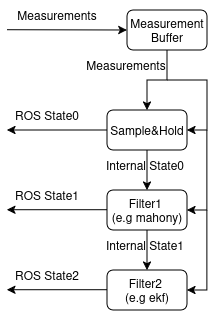

# farol2_nav

## Overview

`farol2_nav` implements navigation estimation as a **single filter pipeline inside one ROS 2 node** (`filter_node`), instead of running one monolithic estimator.

At each timer tick:

1. A measurement snapshot is assembled from asynchronous topics.
2. The pipeline starts from a clean internal state.
3. `sample_and_hold` (pass-through) fills state channels directly from sensors.
4. Additional filters (for example `position_current_ekf`, `yaw_rate_ekf`) refine selected parts of that state.
5. The final fused `NavigationState` is published.

This architecture favors composition: each filter can focus on one sub-problem and still cooperate through a shared state.

## Why this implementation style

- **Composable**: filters are stacked in `filters` order and can be combined.
- **Incremental**: adding a new filter does not require rewriting existing estimators.
- **Traceable**: optional stage outputs (`<filter_name>/state`) allow per-stage inspection.
- **Robust to async sensors**: input topics are buffered and consumed at fixed-rate ticks.
- **Fail-soft**: stale measurements are dropped by timeout without crashing the pipeline.

## Runtime model

### Input buffering

Subscribers update a `MeasurementSnapshot` cache asynchronously. Each message type has its own freshness timestamp.

### Tick-driven processing

The timer runs at `node_frequency` and computes `dt` from wall time. On each tick:

- stale measurements are invalidated by timeout,
- filters run sequentially over the same `State` object,
- the final state is always published,
- consumed measurements are flushed (next tick only sees newly arrived data).

### Filter chain

`sample_and_hold` is always first and implicit.

Then each key in `filters` instantiates one plugin:

- `position_current_ekf`
- `yaw_rate_ekf`

Unknown keys are skipped with a warning.

## Main topics

### Subscribed (short names before remap)

- `imu`
- `gnss`
- `ned_utm`
- `velocity_over_ground`
- `velocity_through_water`
- `depth`
- `altimeter`
- `rudder_angle`
- `rpm_command`

### Published

- `state` (final output)
- `<filter_name>/state` (intermediate outputs when `publish_all_steps=true`, excluding final stage)
- filter-specific debug topics (for example in `yaw_rate_ekf`)

## Core parameters

- `node_frequency` (Hz): pipeline tick rate.
- `publish_all_steps` (bool): publish intermediate stage states.
- `filters` (string[]): ordered plugins after `sample_and_hold`.
- `timeouts.imu`, `timeouts.navsat`, `timeouts.utm`, `timeouts.rpm`: per-sensor freshness limits.

Plugin parameters live under:

- `plugins.position_current_ekf.*`
- `plugins.yaw_rate_ekf.*`

See dedicated filter pages below for details.

## Per-filter documentation

- [sample_and_hold](sample_and_hold.md)
- [position_current_ekf](position_current_ekf.md)
- [yaw_rate_ekf](yaw_rate_ekf.md)

## Adding a new filter plugin

1. Create a class implementing `BaseFilter` (`name`, `configure`, `compute`).
2. Add the implementation to `src/filters` and include header in `filter_node.cpp`.
3. Instantiate it in `build_pipeline()` using a new key in the `filters` switch.
4. Add remapping for `<your_filter>/state` in launch (ROS 2 remapping has no wildcard support for this pattern).
5. Add plugin parameters to vehicle `nav.yaml`.

The key idea is to modify only the extension points, not the existing filter logic.