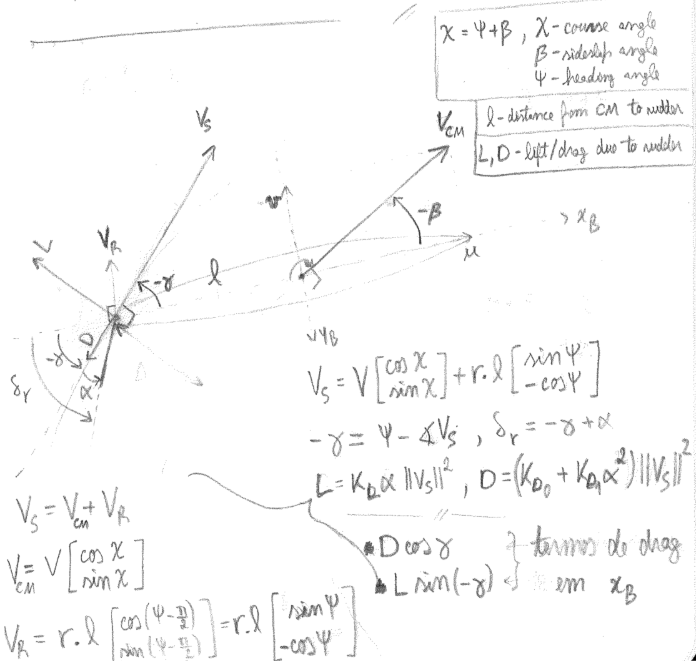
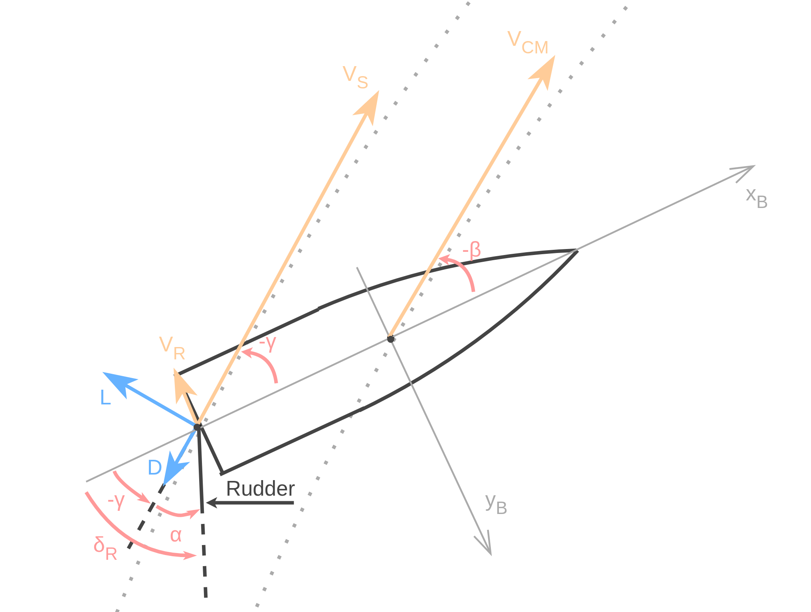

# Control Allocation Package

## Description

As the name suggests, the *control_allocation* package includes control allocation algorithms for marine vessels, i.e., computing the forces vector $\boldsymbol{f} \in \mathbb{R}^r$ for thrusters and/or the angles vector $\boldsymbol{\alpha} \in \mathbb{R}^q$ for rudders/fins, which together produce certain requested forces and torques $\boldsymbol{\tau} \in \mathbb{R}^n$ (wrench) to be applied on the body frame of the vehicle, considering $n$ degrees of freedom (DOFs).

Also, both thruster forces and rudder angle are saturated by minimum and maximum values. The former is saturated at the RPMConversion level by RPM values, while the latter is saturated at the algorithm level.

Specifically, the implemented algortihms are:

- **Static Thruster Allocation**
Consider $\boldsymbol{f}_i = [F_x \, F_y \, F_z]^T$ to be the vector of forces produced by thruster $i$ and $\boldsymbol{l}_i = [l_x \, l_y \, l_z]$ to be the vector of moment arms, i.e., the orthogonal distance between thruster $i$ and each axis of rotation. As such:
$$ \boldsymbol{\tau}_i = \big[ \boldsymbol{f}_i \quad \boldsymbol{f}_i \times \boldsymbol{l}_i \big]^T, \qquad \boldsymbol{\tau} = \big[ \boldsymbol{\tau}_0 \quad ... \quad \boldsymbol{\tau}_{r-1} \big].$$
A more suitable notation is normally used, where the thrust configuration matrix $T$ is introduced:
$$ \boldsymbol{\tau} = T  \boldsymbol{f}, $$
The thrust allocation matrix can be obtained from the first equation for $\boldsymbol{\tau}$, when $||\boldsymbol{f}_i|| = 1, \forall i \in [0, r]$.
As explained in Fossen et. al in "Advanced control and navigation of ROV/AUVs", one strategy is to use the pseudo-inverse, such that:
$$ \boldsymbol{f} = T^+ \boldsymbol{\tau}, \qquad T^+ = T^T (T \, T^T)^{−1} . $$

- **Thruster Rudder Allocation**
1. *Rudder Allocation*
Consider a vehicle with $r$ thrusters working in common mode to achieve a certain force along the body's X axis and a rudder with angle $\delta$. According to Fossen et. al, the torque around the body's Z axis due to the rudder can be expressed as:
$$ N_r = K_s \, l \, ||V_s||^2 \, \delta , $$
where $l$ is the distance from the rudder to the vehicle's center of mass, $V_s$ is the velocity of the rudder relative to the inertial frame and $K_s$ is a constant dependent on the density of the fluid $\rho$, the area of the rudder surface $A_r$ and another rudder constant $C_L^r$, such that $K_s = \rho \, A_r \, C_L^r$. Therefore, the rudder angle can be computed given the requested torque $\tau_r$:
$$ \delta = \dfrac{\tau_r}{K_s \, l \, ||V_s||^2}. $$
The next figure shows a rough sketch of the rudder dynamics:
<!--  -->

Considering $\psi$, $\dot{\psi}$, $u$, $v$ as the vehicle's yaw, yaw_rate, surge and sway, respectively, $\chi$ the course angle and $\beta$ the sideslip angle:
$$ V_s = V 
\begin{bmatrix}
\cos{\chi} \\
\sin{\chi} \\
\end{bmatrix} + \dot{\psi} \, l
\begin{bmatrix}
\sin{\psi} \\
-\cos{\psi} \\
\end{bmatrix} , \\ \, \\
\chi = \psi + \beta ,\qquad \beta = \tan^{-1}\left(\dfrac{v}{u}\right) ,\qquad V = \sqrt{u^2 + v^2} .$$
Moreover, the lift $L$ and drag $D$ terms can also be calculated, given the angle between the rudder and the fluid flow at the rudder $\alpha = \delta + \gamma$ and the angle between the body's X axis and the fluid flow $\gamma = \measuredangle V_s - \psi$:
$$ L = K_L \, \alpha ||V_s||^2, \qquad D = (K_{D0} + K_{D1} \, \alpha^2) ||V_s||^2, $$
where $K_L$, $K_{D0}$ and $K_{D1}$ are constants. As such, the rudder induces a drag $X_d$ along the body's X axis equal to
$$ X_d = D \, \cos{(\gamma)} + L \, \sin{(- \gamma)}.$$
2. *Thruster Allocation*
In order to compute the forces for the thrusters, the requested force along the body's X axis should be adjusted for the rudder induced drag and all other forces/torques should be ignored (due to the common mode concept), which leads to the following expression for the thrusters' forces $\boldsymbol{f}$:
$$ \boldsymbol{f} = T^+ \left(\boldsymbol{\tau} . 
\begin{bmatrix}
1 \\
0_{n-1} \\
\end{bmatrix}^T + 
\begin{bmatrix}
X_d \\
0_{n-1} \\
\end{bmatrix}\right) .$$

When it comes to converting the forces $[N]$ requested by the control allocation method to thruster speed $[RPM]$, the following equation was used:

$$ Force = K_0 + K_1 \times RPM + K_2 \times {RPM}^2 $$

## Nodes

* [static_thruster_allocation](static_thruster_allocation.md)
* [thruster_rudder_allocation](thruster_rudder_allocation.md)
* [rpm_conversion](rpm_conversion.md)

