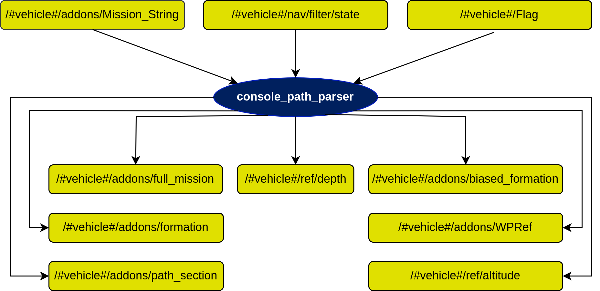

# console_parser Node

## In a nutshell
Parse a string mission from a web interface (PONTE) to paths node that will interact with path following algorithms. 

Note: The important action in this node is to call the services of [paths](...) node to build the path of the mission and start the execution of the path following control via service. Since this is a legacy component of the stack please kindly ignore many of the Subscribers and Publishers because they are not being used at this stage of the stack.

## Diagram

## Subscribers
| Subscribers           | msgs type                                                                        | Purpose                      |
| -----------           | --------------                                                                   | ---------                    |
| "/#vehicle#/addons/Mission_String" | [std_msgs/msg/String](https://docs.ros.org/en/ros2_packages/jazzy/api/std_msgs/msg/String.html) | Mission String |
| "/#vehicle#/nav/filter/state" | [farol_msgs/msg/NavigationState](...) | Navigation Filter State |
| "/#vehicle#/mission_status" | [std_msgs/msg/Int8](https://docs.ros.org/en/ros2_packages/jazzy/api/std_msgs/msg/Int8.html) | Mission Status |

## Publishers
| Publishers | msgs type | Purpose |
| ---------- | --------- | ------- |
| "/#vehicle#/addons/path_section" | [farol_msgs::msg::Section](...) | Path Section |
| "/#vehicle#/addons/formation" | [farol_msgs::msg::Formation](...) | Formation |
| "/#vehicle#/addons/biased_formation" | [farol_msgs::msg::Formation](...) | Biased Formation |
| "/#vehicle#/addons/WPRef" | [geometry_msgs::msg::PointStamped](...) | Waypoint Reference |
| "/#vehicle#/ref/depth" | [std_msgs::msg::Float32](https://docs.ros.org/en/ros2_packages/jazzy/api/std_msgs/msg/Float32.html) | Depth reference |
| "/#vehicle#/ref/altitude" | [std_msgs::msg::Float32](https://docs.ros.org/en/ros2_packages/jazzy/api/std_msgs/msg/Float32.html) | Altitude Reference |
| "/#vehicle#/addons/full_mission" | [farol_msgs::msg::MultiSection](...) | Full Mission |

## Services

| Services                       | srv type                | Purpose                                               |
| --------                       | --------                | -------                                               |
| "/#vehicle#/ResetPath"         | [paths/ResetPath]()     | Reset the actual path to start a new one              |
| "/#vehicle#/SpawnArc2DPath"    | [paths/SpawnArc2D]()    | Add an arc section to the path                        |
| "/#vehicle#/SpawnLinePath"     | [paths/SpawnLine]()     | Add a line section to the path                        |
| "/#vehicle#/PFStart"           | [paths/StartPF]()       | Start path following controller                       |
| "/#vehicle#/PFStop"            | [paths/StopPF]()        | Stop path following controller                        |
| "/#vehicle#/SetConstVdVehicle" | [paths/SetConstSpeed]() | Set the desired velocity for each section of the path |

## Parameters
| Parameters                                        | type   | Purpose                                                   |
| ----------                                        | ----   | -------                                                   |
| /#vehicle#/addons/console_parser/path_folder      | string | Store the path received from http_server                  |
| /#vehicle#/addons/vehicle_id                      | int    | IDs of the medusas: 1 - mred, 2 - mblack, 3 - mvector     |

