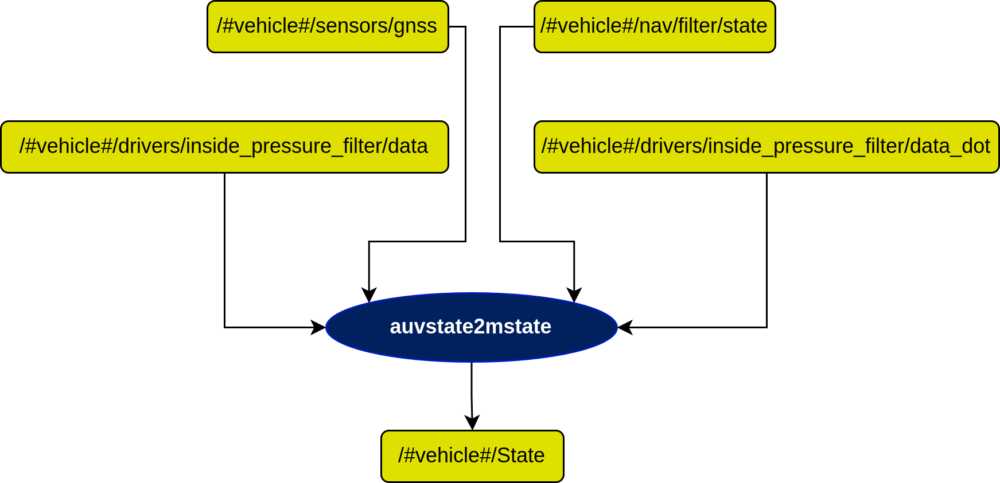

# nav2console_state Node

## In a nutshell
This node converts state in *farol_msgs::NavigationState* to state in *farol_msgs::StateConsole*.

<!-- ## Diagram
 -->

## Subscribers
| Subscribers                          | msgs type                                                                                                                                        | Purpose                                             |
| -----------                          | --------------                                                                       | ---------                                                                         |
| /#vehicle#/nav/filter/state          | [farol\_msgs/NavigationState](...) | The navigation state of the vehicle after filtering |                                |

## Publishers
| Publishers       | msgs type                                                                         | Purpose                                                      |
| -----------      | --------------                                                                    | ---------                                                    |
| /#vehicle#/State | [farol\_msgs/StateConsole](...) | The filtered state of the vehicle turned into StateConsole message |

## Parameters
| Parameters                 | type   | Default     | Purpose                       |
| -----------                | ----   | ----------  | ---------                     |
| /#vehicle#/node\_frequency | float  | 10.0        | Working frequency of the node |

