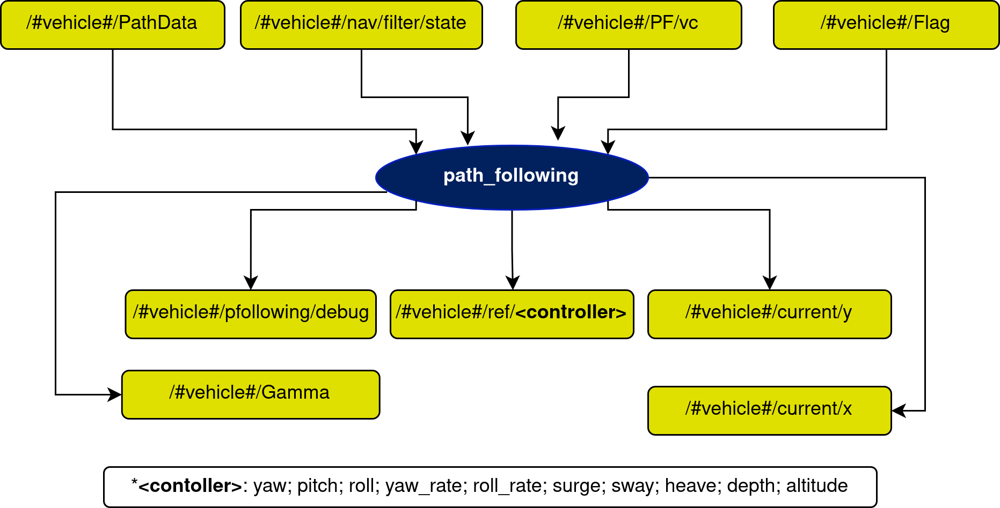

# path\_following Node

## In a nutshell
This node manages the PF properties discussed in the [implementation](implementation.md) section. You can find further explanation of the Path Following algorithms in this [paper](https://arxiv.org/abs/2204.07319).

## Diagram

## Subscribers
| Subscribers | msg type | Purpose |
| --- | --- | --- |
| /#vehicle#/nav/filter/state | [farol\_msgs/NavigationState](...) | Filtered state of the vehicle |
| /#vehicle#/control/outer_loop/path_data | [paths/PathData](...) | Path information sent from the path managing node |
| /#vehicle#/control/outer_loop/path_following/vc | [std\_msgs/Float32](http://docs.ros.org/en/api/std_msgs/html/msg/Float32.html) | Velocity correction sent from the CPF node (if deployed) |
| /#vehicle#/mission_status | [std\_msgs/Int8](http://docs.ros.org/en/api/std_msgs/html/msg/Int8.html) | Flag that determines the state of the vehicle (idle, following waypoint, path, etc.) |

## Publishers
| Publishers | msg type | Purpose |
| --- | --- | --- |
| /#vehicle#/control/outer_loop/gamma | [std\_msgs/Float32](http://docs.ros.org/en/api/std_msgs/html/msg/Float32.html) | Vehicle progression relative to the path parameter |
| /#vehicle#/control/outer_loop/path_following/debug | [farol\_msgs/mPFDebug](...) | Topic used for debugging purposes only |
| /#vehicle#/current/x | [std\_msgs/Float32](http://docs.ros.org/en/api/std_msgs/html/msg/Float32.html) | Observe x current component |
| /#vehicle#/current/y | [std\_msgs/Float32](http://docs.ros.org/en/api/std_msgs/html/msg/Float32.html) | Observe y current component |
| /#vehicle#/ref/`<controller>` | [std\_msgs/Float32](http://docs.ros.org/en/api/std_msgs/html/msg/Float32.html) | References to be given to the inner loops |
| /#vehicle#/mission_status | [std\_msgs/Int8](http://docs.ros.org/en/api/std_msgs/html/msg/Int8.html) | Flag that determines the state of the vehicle (idle, following waypoint, path, etc.) |

## Services
| Services | msg type | Purpose |
| --- | --- | --- |
| /#vehicle#/control/outer_loop/path_following/PFStart | [path\_following/StartPF](StartPF.md) | Run the previously established path following |
| /#vehicle#/control/outer_loop/path_following/PFStop | [path\_following/StopPF](StopPF.md) | Stop the current PF mission |
| /#vehicle#/control/outer_loop/path_following/PFUpdateGains | [path\_following/UpdateGainsPF](UpdateGainsPF.md) | Update PF gains in real time |
| /#vehicle#/control/outer_loop/path_following/ResetVT | [path\_following/ResetVT](ResetVT.md) | Reset virtual target of current mission |
| /#vehicle#/control/outer_loop/path_following/PFSetRelativeHeading | [path\_following/SetPF](SetPF.md) | Set the desired PF algorithm to Relative Heading |
| /#vehicle#/control/outer_loop/path_following/PFSetMarcelo | [path\_following/SetPF](SetPF.md) | Set the desired PF algorithm to Marcelo |
| /#vehicle#/control/outer_loop/path_following/PFSetAguiar | [path\_following/SetPF](SetPF.md) | Set the desired PF algorithm to Aguiar |
| /#vehicle#/control/outer_loop/path_following/PFSetBreivik | [path\_following/SetPF](SetPF.md) |Set the desired PF algorithm to Breivik |
| /#vehicle#/control/outer_loop/path_following/PFSetFossen | [path\_following/SetPF](SetPF.md) | Set the desired PF algorithm to Fossen |
| /#vehicle#/control/outer_loop/path_following/PFSetRomulo | [path\_following/SetPF](SetPF.md) | Set the desired PF algorithm to Romulo |
| /#vehicle#/control/outer_loop/path_following/PFSetLapierre | [path\_following/SetPF](SetPF.md) | Set the desired PF algorithm to Lapierre |
| /#vehicle#/control/outer_loop/path_following/PFSetPramod | [path\_following/SetPF](SetPF.md) | Set the desired PF algorithm to Pramod |
| /#vehicle#/control/outer_loop/path_following/PFSetSamson | [path\_following/SetPF](SetPF.md) | Set the desired PF algorithm to Samson |
| /#vehicle#/control/outer_loop/path_following/ResetPath | [paths/ResetPath](...) | Resets the current path |
| /#vehicle#/control/outer_loop/path_following/SetMode | [paths/SetMode](...) | Set if mode of operation calculates closest point to the path or if it receives an external gamma for path progression |
| /#vehicle#/control/outer_loop/send\_wp\_standard | [waypoint/SendWpType1](...) | Send a waypoint, especially used at end of the PF algorithm |

## Parameters

### Lapierre Algorithm
| Parameters | type | Default |
| --- | --- | --- |
| k1 | float | 1.0 |
| k2 | float | 0.3 |
| k3 | float | 0.3 |
| theta | float | 0.8 |
| k\_delta | float | 1.0 |

### Marcelo Algorithm
| Parameters | type | Default |
| --- | --- | --- |
| delta | float | -1.0 |
| kx | float | 0.5 |
| ky | float | 0.5 |
| kz | float | 0.5 |
| k\_pos | float | 2.0 |
| k\_currents | float | 0.2 |
| rd | array | [0.0, 0.0, 1.0] |
| d | array | [0.0, 0.0, 0.0] |

### Aguiar Algorithm
| Parameters | type | Default |
| --- | --- | --- |
| delta | float | -1.0 |
| kx | float | 0.5 |
| ky | float | 0.5 |
| kz | float | 0.5 |
| k\_pos | float | 0.5 |
| k\_currents | float | 0.5 |

### Romulo Algorithm
| Parameters | type | Default |
| --- | --- | --- |
| ke | array | [0.05, 0.0, 0.0, 0.05] |
| kz | float | 0.2 |

### Pramod Algorithm
| Parameters | type | Default |
| --- | --- | --- |
| kp | float | 0.02 |
| ki | float | 0.0005 |

### Samson Algorithm
| Parameters | type | Default |
| --- | --- | --- |
| k1 | float | 1.0 |
| k2 | float | 0.3 |
| k3 | float | 0.3 |
| theta | float | 0.8 |
| k\_delta | float | 1.0 |

### Relative Heading Algorithm
| Parameters | type | Default |
| --- | --- | --- |
| kx | float | 0.5 |
| ky | float | 0.1 |
| kz | float | 0.2 |
| yaw\_offset | float | 0.785 |
| p\_sat | array | [1.0, 1.0] |

### General Parameters
| Parameters | type | Default | Purpose |
| --- | --- | --- | --- |
| node\_frequency | float | 10.0 | Working frequency of the node |